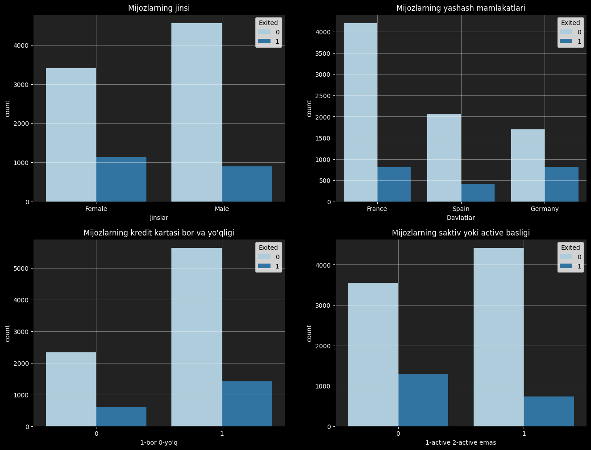
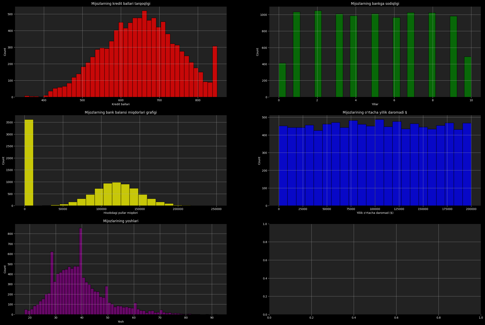
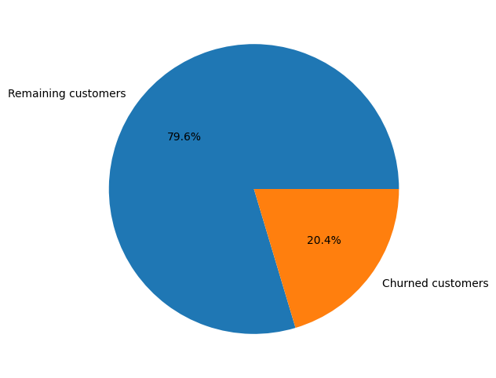
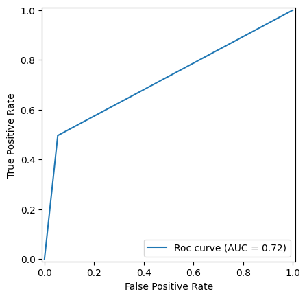
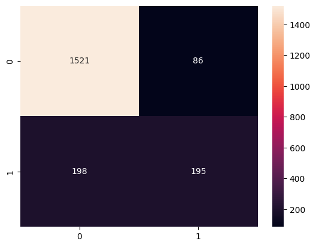

# Customer Churn Prediction Model

Loyiha: **Customer Churn Prediction**  
Muallif: Muhammad Ibrohimov  
Hozirgi holati: yakunlangan

## Maqsad

Ushbu loyiha mijozlarning churn (foydalanuvchi ketishi) ehtimolini bashorat qilishga qaratilgan.  
Bu tahlil va model yaratish jarayonida quyidagilar o‘rganiladi:

- Ma’lumotlarni tahlil qilish (EDA — Exploratory Data Analysis)  
- Ma’lumotlarni tozalash va tayyorlash  
- Grafiklar yordamida visualizatsiya  
- Model yaratish, optimallashtirish va baholash  
- Churn ehtimolini prognozlash  

## Strukturasi
```
Customer_churn_prediction_model/
├── Customer_Churn.ipynb ← Jupyter Notebook: butun ish jarayoni
├── data/ ← (agar bo‘lsa) ma’lumotlar fayllari
├── models/ ← (agar saqlansa) trening qilingan modellar
└── README.md ← Loyihaning tavfsifi (shu fayl)
```


## Talablar

- Python 3.x  
- Kitobxonliklar: `pandas`, `numpy`, `matplotlib`, `seaborn`, `scikit-learn`, va boshqalar  
- Jupyter Notebook muhiti  

## Qay tarzda ishlatish

## O‘rnatish va ishga tushirish

1. Repozitoriyani klonlang:
   ```bash
   git clone https://github.com/muhammadibrohimov-ai/Customer_churn_prediction_model.git
   cd Customer_churn_prediction_model
   pip install -r requirements.txt
   ```

2. Notebook’ni ishga tushiring:

    ```bash
    jupyter notebook Customer_Churn.ipynb
   ```

## EDA (Exploratory Data Analysis)

Ma’lumotlar to‘plami quyidagi asosiy xususiyatlar bo‘yicha tahlil qilindi:

- **Categorical Features** (Gender, Geography, HasCrCard, IsActiveMember)  
- **Numerical Features** (CreditScore, Tenure, Balance, EstimatedSalary, Age)  
- **Churn Distribution** (Exited)

📊 Quyidagi grafiklarda ko‘rinib turibdi:  

<p align="center">
  
  
  
</p>


## Foydalanilgan modellar

Quyidagi ML modellar sinovdan o‘tkazildi:

- Logistic Regression  
- Decision Tree  
- Random Forest
- SVM  
- Gradient Boosting (XGBoost)  

## Modellar natijalari

| Model               | Accuracy | Precision (1) | Recall (1) | F1-score (1) | ROC-AUC |
|---------------------|----------|---------------|------------|--------------|---------|
| Logistic Regression | 0.81     | 0.55          | 0.20       | 0.29         | 0.58    |
| SVC                 | 0.86     | 0.79          | 0.37       | 0.51         | 0.67    |
| Decision Tree       | 0.86     | 0.74          | 0.45       | 0.56         | 0.71    |
| Random Forest       | 0.87     | 0.77          | 0.47       | 0.58         | 0.72    |
| XGBoost             | 0.86     | 0.69          | 0.50       | 0.58         | 0.72    |

---

## ROC Curve va Confusion Matrix (XGBoost)

📊 Quyidagi grafiklar XGBoost modelining ishlashini ko‘rsatadi:  

- ROC Curve  
- Confusion Matrix  

<p align="center">
  
  
</p>

---

## Xulosa

Loyihada ishlatilgan ma’lumotlarda kuchli korrelyatsiya kuzatilmadi, shuning uchun ko‘plab modellar yuqori aniqlik ko‘rsatolmadi.  
Shunga qaramay, ikkita model nisbatan yaxshi natija berdi: **Random Forest** va **XGBoost (XGBClassifier)**.  

- **Random Forest**: ROC-AUC = 0.72, Accuracy = 0.87  
- **XGBoost**: ROC-AUC = 0.72, Accuracy = 0.86  

Bu ikki model ichida **XGBClassifier** nisbatan yaxshiroq ko‘rsatkich berdi va eng muhimi, **train vaqti ham kamroq bo‘ldi**.  
Shu sababli, ushbu loyiha uchun hozircha **eng yaxshi model XGBClassifier** deb tanlandi.
